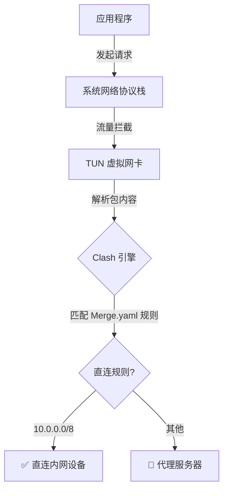
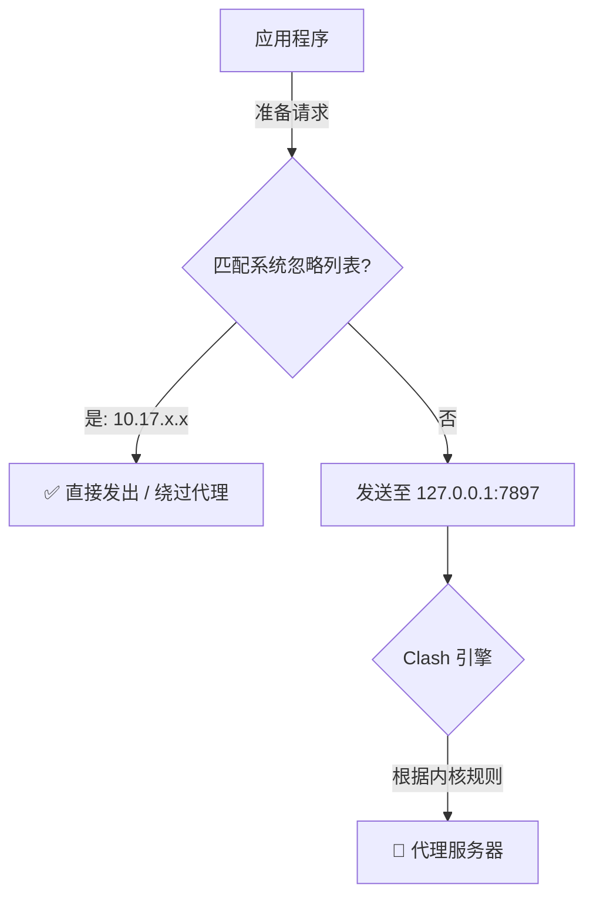

# Clash Verge 代理模式与内网直连配置指南

在访问公司内网资源（如 `10.17.0.22`）时，根据 Clash Verge 运行模式的不同，需要采取不同的直连方案。以下是两种情况的详细说明。

---

## 模式一：TUN 模式 (强制网卡接管)

### 1. 原理与流程图
Clash 创建一个虚拟网卡（utun），接管系统**网络层 (L3)** 的所有流量。无论应用本身是否支持代理，所有数据包在离开物理网卡前都会被强制拦截并交给 Clash 引擎。



### 2. 解决方案：修改 Clash 内部规则
在这种模式下，内网流量能否直连，完全取决于 Clash 的 **Merge 规则**。

*   **配置文件路径**: 
    `~/Library/Application Support/io.github.clash-verge-rev.clash-verge-rev/profiles/Merge.yaml`
*   **关键配置项**: `prepend-rules`
*   **代码示例**:
    ```yaml
    prepend-rules:
      - DOMAIN,gitlab.anyverse.work,DIRECT
      - IP-CIDR,10.0.0.0/8,DIRECT,no-resolve  # 核心规则：将10网段设为直连
    ```

### 3. 特点
*   **优点**: 覆盖范围最广，不支持代理设置的应用（如终端、旧软件）也能生效。
*   **缺点**: 如果 Clash 规则没写好，会导致内网也去绕远路走代理，甚至完全断连。

---

## 模式二：系统代理模式 (应用层转发)

### 1. 原理与流程图
Clash 仅在本地监听端口（如 `7897`）。应用（如 Chrome）在发起请求前，会先读取系统的“忽略代理列表”。


应用在发送请求前，会先查看系统的 **“忽略代理列表”**。

### 2. 解决方案：修改 macOS 系统设置
在这种模式下，为了保证内网访问不进 Clash，需要在 macOS 系统层进行排除。

*   **配置路径**: `系统设置` -> `网络` -> `Wi-Fi (或以太网)` -> `详细信息` -> `代理`
*   **关键配置项**: `忽略这些主机与域的代理设置` (Bypass)
*   **配置内容**:
    ```text
    10.*, 172.16.*, 192.168.*, *.anyverse.work, localhost, 127.0.0.1
    ```

### 3. 特点
*   **优点**: 性能消耗极低，内网流量完全不经过 Clash 进程，稳定性最高。
*   **缺点**: 部分不遵循系统代理设置的应用（如某些命令行工具）可能仍会走默认网卡导致无法上网。

---

## 总结与对比

| 维度 | TUN 模式 | 系统代理模式 |
| :--- | :--- | :--- |
| **工作层面** | 网络层 (虚拟网卡) | 应用层 (HTTP/SOCKS) |
| **直连靠谁** | **Clash 内部规则** | **macOS 系统设置** |
| **内网表现** | 由 Clash 决定转发 | 由 macOS 决定是否发给 Clash |
| **首选建议** | 适合需要全局代理、处理特殊协议时 | 适合大多数 Web 开发场景，更稳定 |

---

## 验证方法 (Terminal)

无论哪种模式，你都可以运行以下命令测试：

1.  **测试绕过代理直连**:
    ```bash
    curl -I --noproxy '*' http://10.17.0.22:8080
    ```
2.  **查看 Clash 实时生效规则**:
    ```bash
    curl -s --unix-socket /tmp/verge/verge-mihomo.sock http://localhost/rules
    ```

---

维护者: 基座模型组
