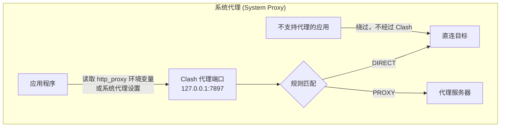
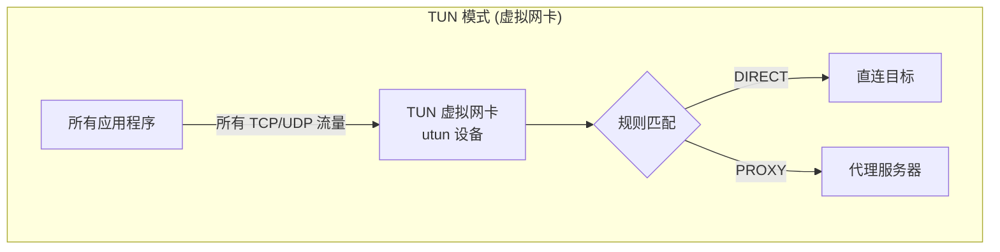

# 网络问题详解

## 一、为什么现在能访问了？

**跟 VPN 白名单无关**，核心原因是 Docker 容器的**网络模式**从 bridge 切换成了 host。

### Bridge 模式（之前，不通）

```
你的 Mac ──→ 10.17.0.22:8888 ──→ docker-proxy ──→ NAT转发 ──→ 容器(10.0.0.3:8080)
                                     ↑
                                   问题在这里
```

Docker 的 `docker-proxy` 进程负责在宿主机端口(8888)和容器端口(8080)之间转发。
对来自**本机(localhost)** 的请求，它工作正常；但对来自**外部网络(10.17.x.x)** 的请求，它返回了空响应。
这是 Docker bridge 网络 + iptables NAT 在特定网络拓扑下的已知行为问题。

### Host 模式（现在，通了）

```
你的 Mac ──→ 10.17.0.22:8080 ──→ Caddy 直接监听
                                   没有中间层
```

`--network host` 让容器直接使用宿主机的网络栈，Caddy 绑定在 `0.0.0.0:8080`，
和在宿主机上直接运行一个进程一样，没有任何端口转发层。

> [!IMPORTANT]
> 我们加的 Clash Verge 直连规则 `IP-CIDR,10.0.0.0/8,DIRECT` 也起了作用 ——
> 确保你 Mac 的流量不走代理而是直接发到 10.17.0.22。两个修复缺一不可。

---

## 二、Clash Verge 的直连规则在哪里设置的？

修改的文件路径：

```
~/Library/Application Support/io.github.clash-verge-rev.clash-verge-rev/profiles/Merge.yaml
```

这是 Clash Verge 的**全局扩展配置**，`prepend-rules` 中的规则会插入到所有订阅规则的**最前面**（优先级最高）：

```yaml
prepend-rules:
  # 公司内网服务直连
  - DOMAIN,gitlab.anyverse.work,DIRECT
  - DOMAIN,docker.anyverse.work,DIRECT
  # RFC1918 私有地址段全部直连
  - IP-CIDR,10.0.0.0/8,DIRECT,no-resolve    # ← 覆盖所有 10.x.x.x 内网
  - IP-CIDR,172.16.0.0/12,DIRECT,no-resolve
  - IP-CIDR,192.168.0.0/16,DIRECT,no-resolve
```

你也可以在 Clash Verge UI 中查看/编辑：**订阅页面 → 全局扩展配置(Merge) → 编辑**。

---

## 三、TUN 模式 vs 系统代理的区别





| 维度 | 系统代理 | TUN 模式 |
|---|---|---|
| **工作层级** | 应用层 (L7) | 网络层 (L3) |
| **覆盖范围** | 仅支持代理设置的应用（浏览器、curl 等） | **所有应用**的所有流量，无一例外 |
| **实现方式** | 设置 `http_proxy` 环境变量 + 系统代理 | 创建虚拟网卡 (utun)，修改路由表 |
| **漏网之鱼** | 不读代理变量的程序会绕过 | 无，全部拦截 |
| **类比** | 在门口贴告示"请走这条路" | 直接把路改了，只有一条路可走 |
| **对内网影响** | 较小（SSH 等不走代理） | 较大（必须配 DIRECT 规则否则内网也走代理） |
| **性能** | 轻量 | 略重（多一层网卡处理） |

> [!TIP]
> 你的 Clash Verge 开了 **TUN 模式**，所以所有流量（包括 `10.17.x.x` 内网）都被 Clash 接管。
> 这就是为什么必须加 `IP-CIDR,10.0.0.0/8,DIRECT` 规则 —— 告诉 Clash "这些地址直连，别代理"。
> 如果只用系统代理模式，SSH 这类不读 `http_proxy` 的工具本来就不受影响。

---

## 四、域名映射方案

### 方案 A：DNS + 直接访问（最简单，不需要 Nginx）

如果你有内网 DNS 管理权限（或者用公司已有的 `*.anyverse.work` 域名），只需加一条 A 记录：

```
web.anyverse.work → 10.17.0.22
```

然后访问 `http://web.anyverse.work:8080`。不需要 Nginx，Caddy 直接服务。

> [!NOTE]
> 缺点：URL 里需要带 `:8080` 端口号。

### 方案 B：DNS + Nginx 反向代理（推荐，标准端口）

如果想用 `http://web.anyverse.work`（不带端口，默认 80），需要 Nginx：

```nginx
# /etc/nginx/sites-available/web_server.conf
server {
    listen 80;
    server_name web.anyverse.work;

    location / {
        proxy_pass http://127.0.0.1:8080;
        proxy_set_header Host $host;
        proxy_set_header X-Real-IP $remote_addr;
        proxy_set_header X-Forwarded-For $proxy_add_x_forwarded_for;
    }
}
```

### 方案 C：直接让 Caddy 监听 80 端口（最省事）

容器内的 Caddy 本身就是 Web 服务器，可以直接配置它监听 80 端口，无需额外 Nginx。
需要修改容器内的 Caddyfile 或环境变量，让 Caddy 从 8080 改为监听 80。

> [!WARNING]
> 监听 80 端口需要 root 权限（或 `NET_BIND_SERVICE` capability）。
> `--network host` 模式下，端口 80 如果已被占用（如已有 Nginx），会冲突。

### 建议

如果 22 机器上**已有 Nginx**：用方案 B，加一个 server block 反代到 8080。
如果 22 机器上**没有 Nginx**：用方案 C，让 Caddy 直接听 80，最简单。

---

维护者: 基座模型组
